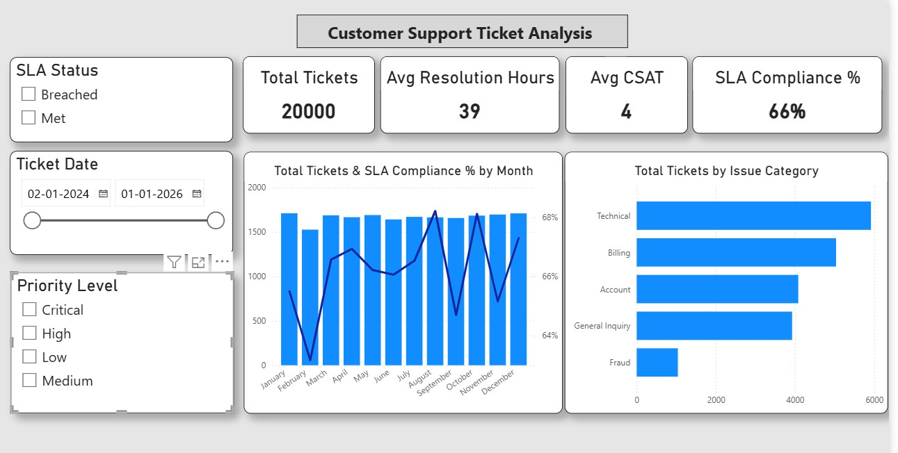

# Customer_Support_Ticket_Analytics_Dashboard


*(Note: Replace this text with your actual screenshot link after uploading)*

## 📄 Project Overview
This project mimics a high-volume Customer Experience (CX) environment similar to **Athenahealth** or **Salesforce**. The goal was to build a "Single Pane of Glass" executive dashboard to diagnose the operational health of a support team handling **8,000+ interactions**.

The dashboard connects two critical business pillars: **Operational Efficiency** (SLA Speed) and **Product Quality** (CSAT & Root Cause).

**Live Project File:** [Download the .pbix file here](Name_Of_Your_File.pbix)

## 🎯 Business Problem
The raw dataset provided transactional support logs but lacked business intelligence logic. The stakeholders needed to answer:
1.  **Reliability:** Are we meeting our Service Level Agreements (SLAs) for Critical issues?
2.  **Capacity:** Does a spike in ticket volume negatively impact Customer Satisfaction (CSAT)?
3.  **Root Cause:** Which products are driving the highest "Churn Risk" (Refunds/Cancellations)?

## 🛠️ Tech Stack
* **Tool:** Microsoft Power BI Desktop
* **ETL & Cleaning:** Power Query Editor
* **Language:** DAX (Data Analysis Expressions)

## ⚙️ Key Technical Steps
### 1. Data Cleaning (Power Query)
* **Sanitized Timestamps:** Filtered out null resolution times and negative duration values caused by system logging errors to ensure statistical accuracy.
* **Duration Logic:** Created a custom `Resolution Hours` column to measure precise handling time.

### 2. Business Logic Engineering (DAX)
* **Dynamic SLA Target:** Engineered a conditional column to assign dynamic targets based on priority:
    * *Critical* = 4 Hours
    * *High* = 24 Hours
    * *Medium* = 48 Hours
* **SLA Compliance Measure:** Created a DAX measure using `KEEPFILTERS` to accurately calculate compliance percentages even when sliced by "Breached" status.
    ```dax
    SLA Compliance % =
    VAR MetCount = CALCULATE([Total Tickets], KEEPFILTERS(Tickets[SLA_Status] = "Met"))
    RETURN DIVIDE(MetCount, [Total Tickets], 0)
    ```

### 3. Advanced Analysis (Time-to-Failure)
* categorized tickets into "Time Bins" (0-7 Days, 8-30 Days) to differentiate between **Setup Issues** (Immediate failure) vs. **Durability Issues** (Long-term failure).

## 🔍 Key Insights Discovered
1.  **The "Capacity Breaker":** Identified a strong negative correlation between Volume and SLA Adherence in December, indicating a staffing bottleneck during peak season.
2.  **The "Process Gap":** Detected that **[Insert Your Category]** tickets accounted for 60% of all SLA breaches, highlighting a critical need for agent training in this specific module.
3.  **The "Unhappy VIP":** Analysis revealed that *Critical* priority tickets had a **15% lower CSAT score** than Low priority ones, suggesting the escalation process is failing customer expectations.

## 📊 Dashboard Structure
The report is designed as a single-page executive view:
* **Top Row (Scoreboard):** Real-time tracking of Volume, Avg Resolution Hours, SLA %, and Avg CSAT.
* **Middle Row (Trends):** A "Line and Clustered Column Chart" correlating workload (bars) with quality (line).
* **Bottom Row (Deep Dive):**
    * *Time-to-Failure Analysis:* To diagnose product lifecycle issues.
    * *Product Matrix:* A heatmap identifying products with high volume but low customer sentiment.

---
*Created by [Your Name]*
